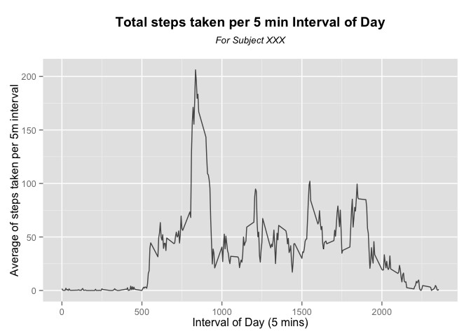

# Reproducible Research: Peer Assessment 1


## Introduction
It is now possible to collect a large amount of data about personal
movement using activity monitoring devices such as a
[Fitbit](http://www.fitbit.com), [Nike
Fuelband](http://www.nike.com/us/en_us/c/nikeplus-fuelband), or
[Jawbone Up](https://jawbone.com/up). These type of devices are part of
the "quantified self" movement -- a group of enthusiasts who take
measurements about themselves regularly to improve their health, to
find patterns in their behavior, or because they are tech geeks. But
these data remain under-utilized both because the raw data are hard to
obtain and there is a lack of statistical methods and software for
processing and interpreting the data.

This assignment makes use of data from a personal activity monitoring
device. This device collects data at 5 minute intervals through out the
day. The data consists of two months of data from an anonymous
individual collected during the months of October and November, 2012
and include the number of steps taken in 5 minute intervals each day. Our
report will be answering questions based on the insight provided by this data.

## Loading and preprocessing the data  
Data was loaded directly from a zipped CSV file:

```r
# Setting right folder
setwd("~/GitHub/RepData_PeerAssessment1")
#Reading data
activity_data <- read.csv(unz("activity.zip", "activity.csv"))
#Converting Date from strings to date format
activity_data$date <- as.Date(activity_data$date,"%Y-%m-%d")
```


## What is mean total number of steps taken per day?


```r
    library(dplyr)
    library(ggplot2)
    #Grouping intervals by date
        dates.g <- group_by(activity_data, date)
    # Summarizing steps by day
        steps_per_day.df <- summarize(dates.g, steps_per_day = sum(steps, na.rm = TRUE))
    # Creating Graph
        ## Setup ggplot with data frame
        g <- ggplot(steps_per_day.df, aes(x = date, y = steps_per_day))
        g + geom_bar(alpha = 7/10, stat = "identity") +
            labs(x = "Day") +
            labs(y = "Steps per Day") +
            labs(title = expression(atop(bold("Total steps taken per Day"), atop(italic("For Subject XXX"), ""))))
```

 

```r
    # Calculate and report the mean and median total number of steps taken per day
        # Mean steps per day
            avg_steps_day <- mean(steps_per_day.df$steps_per_day)
        # Median steps per day
            median_steps_per_day <- median(steps_per_day.df$steps_per_day)
```
The mean of steps taken per day is **9,354.23**, while the median of the steps taken per day was **10,395** steps.

## What is the average daily activity pattern?

```r
        #Grouping records by interval
        intervals.g <- group_by(activity_data, interval)
        # Summarizing steps by day
        steps_per_interval.df <- summarize(intervals.g, steps_per_interval = mean(steps, na.rm = TRUE))
        
        # Creating Graph
        ## Setup ggplot with data frame
        g <- ggplot(steps_per_interval.df, aes(x = interval, y = steps_per_interval))
        g + geom_line(alpha = 7/10, color = "black", stat = "identity") +
            labs(x = "Interval of Day (5 mins)") +
            labs(y = "Average of steps taken per 5m interval") +
            labs(title = expression(atop(bold("Total steps taken per 5 min Interval of Day"), atop(italic("For Subject XXX"), ""))))
```

 

```r
        # Interval with most steps
        most_steps_interval_idx <- which.max(steps_per_interval.df$steps_per_interval)
        most_steps_interval_lbl <- steps_per_interval.df$interval[most_steps_interval_idx]
```
The interval with most steps, in average, is the **104th** interval, which corresponds to the interval starting at **835hrs**.

## Imputing missing values


## Are there differences in activity patterns between weekdays and weekends?
